# primitive

`primitive` turns photos and artwork into **stylized reconstructions built from simple geometric shapes**.

Give it an input image and it searches for a layered approximation you can export as **PNG, JPG, GIF, or clean SVG** output.

<table>
  <tr>
    <td align="center"></td>
    <td align="center">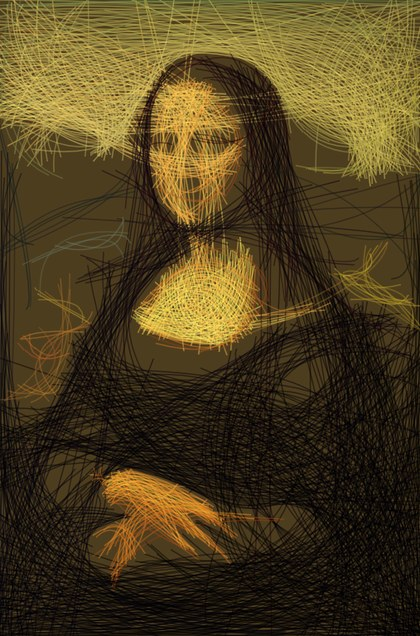</td>
    <td align="center">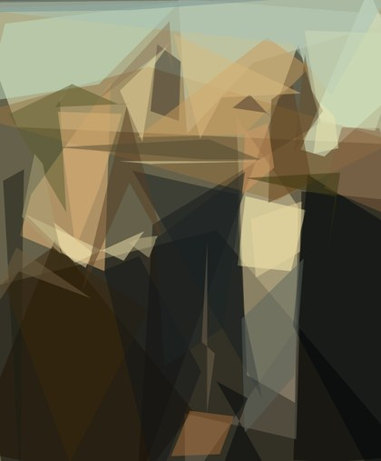</td>
    <td align="center"></td>
  </tr>
  <tr>
    <td align="center"><sub>Mona Lisa · mixed · 200 steps</sub></td>
    <td align="center"><sub>Mona Lisa · quadratic · 1000 steps</sub></td>
    <td align="center"><sub>American Gothic · polygon · 50 steps</sub></td>
    <td align="center"><sub>Fiume Po (M.Kenna) · circle · 200 steps</sub></td>
  </tr>
</table>

Inspired by Michael Fogleman's original [`primitive`](https://github.com/fogleman/primitive), this repository is an **independent Rust implementation** with a reusable core library (`primitive-core`) and a CLI (`primitive-cli`).

## Highlights

- Fast hill-climbing search with multi-threaded worker contexts
- Nine shape modes in the CLI: mixed (`any`), triangle, rectangle, ellipse, circle, rotated rectangle, quadratic curve, rotated ellipse, and polygon
- Small working-resolution optimization with high-resolution output replay
- Vector export via SVG, plus raster output for PNG, JPG, and animated GIFs

## Install

Clone the standalone repository:

```bash
git clone git@github.com:aleburato/rusty-primitive.git
cd rusty-primitive
```

Build the release binary from the workspace:

```bash
cargo build --release
```

Or install the CLI locally:

```bash
cargo install --path crates/primitive-cli
```

## Quick Start

Run the CLI against one of the bundled README originals:

```bash
./target/release/primitive-cli run \
  docs/readme/originals/monalisa.jpg \
  --output output/monalisa.png \
  --emit png,svg \
  --count 1000 \
  --shape any
```

Useful options:

- `--shape any|triangle|rectangle|ellipse|circle|rotated-rectangle|quadratic|rotated-ellipse|polygon`
- `--count <N>` to control the number of optimization steps
- `--resize-input <N>` to set the working resolution (default `256`)
- `--output-size <N>` to set the final replay resolution (default `1024`)
- `--seed <N>` for deterministic output
- `--emit png,jpg,svg,gif` to choose one or more output formats

See the full CLI help with:

```bash
./target/release/primitive-cli run --help
```

## Progression Gallery

Each table below shows one original image, with shape modes in rows and step counts in columns. Every preview is a JPEG thumbnail that links to the generated SVG.

### Mona Lisa

<p>
  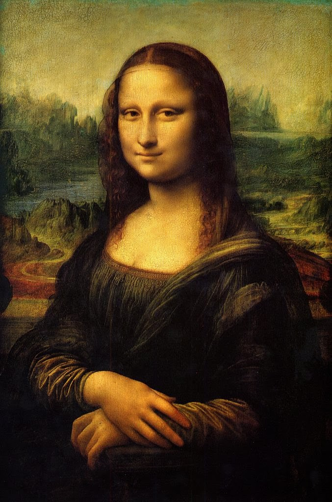<br />
  <sub>Original · JPG 149.5 KB</sub>
</p>

<table>
  <tr>
    <th align="left">Shape mode</th>
    <th align="center">50 steps</th>
    <th align="center">200 steps</th>
    <th align="center">1000 steps</th>
  </tr>
  <tr>
    <td><strong>Mixed</strong></td>
    <td align="center">
      <a href="docs/readme/progression/monalisa/any-50.svg">
        
      </a>
      <br />
      <sub>SVG 6.9 KB</sub>
    </td>
    <td align="center">
      <a href="docs/readme/progression/monalisa/any-200.svg">
        
      </a>
      <br />
      <sub>SVG 26.0 KB</sub>
    </td>
    <td align="center">
      <a href="docs/readme/progression/monalisa/any-1000.svg">
        
      </a>
      <br />
      <sub>SVG 135.0 KB</sub>
    </td>
  </tr>
  <tr>
    <td><strong>Triangle</strong></td>
    <td align="center">
      <a href="docs/readme/progression/monalisa/triangle-50.svg">
        
      </a>
      <br />
      <sub>SVG 4.6 KB</sub>
    </td>
    <td align="center">
      <a href="docs/readme/progression/monalisa/triangle-200.svg">
        
      </a>
      <br />
      <sub>SVG 17.9 KB</sub>
    </td>
    <td align="center">
      <a href="docs/readme/progression/monalisa/triangle-1000.svg">
        
      </a>
      <br />
      <sub>SVG 88.5 KB</sub>
    </td>
  </tr>
  <tr>
    <td><strong>Rectangle</strong></td>
    <td align="center">
      <a href="docs/readme/progression/monalisa/rectangle-50.svg">
        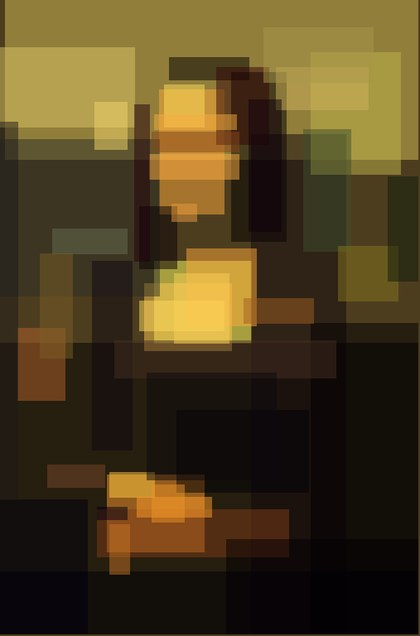
      </a>
      <br />
      <sub>SVG 4.9 KB</sub>
    </td>
    <td align="center">
      <a href="docs/readme/progression/monalisa/rectangle-200.svg">
        
      </a>
      <br />
      <sub>SVG 18.8 KB</sub>
    </td>
    <td align="center">
      <a href="docs/readme/progression/monalisa/rectangle-1000.svg">
        
      </a>
      <br />
      <sub>SVG 92.5 KB</sub>
    </td>
  </tr>
  <tr>
    <td><strong>Ellipse</strong></td>
    <td align="center">
      <a href="docs/readme/progression/monalisa/ellipse-50.svg">
        
      </a>
      <br />
      <sub>SVG 4.8 KB</sub>
    </td>
    <td align="center">
      <a href="docs/readme/progression/monalisa/ellipse-200.svg">
        
      </a>
      <br />
      <sub>SVG 18.3 KB</sub>
    </td>
    <td align="center">
      <a href="docs/readme/progression/monalisa/ellipse-1000.svg">
        
      </a>
      <br />
      <sub>SVG 90.2 KB</sub>
    </td>
  </tr>
  <tr>
    <td><strong>Circle</strong></td>
    <td align="center">
      <a href="docs/readme/progression/monalisa/circle-50.svg">
        
      </a>
      <br />
      <sub>SVG 4.8 KB</sub>
    </td>
    <td align="center">
      <a href="docs/readme/progression/monalisa/circle-200.svg">
        
      </a>
      <br />
      <sub>SVG 18.3 KB</sub>
    </td>
    <td align="center">
      <a href="docs/readme/progression/monalisa/circle-1000.svg">
        
      </a>
      <br />
      <sub>SVG 90.1 KB</sub>
    </td>
  </tr>
  <tr>
    <td><strong>Rotated Rectangle</strong></td>
    <td align="center">
      <a href="docs/readme/progression/monalisa/rotated-rectangle-50.svg">
        
      </a>
      <br />
      <sub>SVG 7.9 KB</sub>
    </td>
    <td align="center">
      <a href="docs/readme/progression/monalisa/rotated-rectangle-200.svg">
        
      </a>
      <br />
      <sub>SVG 31.1 KB</sub>
    </td>
    <td align="center">
      <a href="docs/readme/progression/monalisa/rotated-rectangle-1000.svg">
        
      </a>
      <br />
      <sub>SVG 153.9 KB</sub>
    </td>
  </tr>
  <tr>
    <td><strong>Quadratic</strong></td>
    <td align="center">
      <a href="docs/readme/progression/monalisa/quadratic-50.svg">
        
      </a>
      <br />
      <sub>SVG 8.4 KB</sub>
    </td>
    <td align="center">
      <a href="docs/readme/progression/monalisa/quadratic-200.svg">
        
      </a>
      <br />
      <sub>SVG 33.3 KB</sub>
    </td>
    <td align="center">
      <a href="docs/readme/progression/monalisa/quadratic-1000.svg">
        
      </a>
      <br />
      <sub>SVG 165.9 KB</sub>
    </td>
  </tr>
  <tr>
    <td><strong>Rotated Ellipse</strong></td>
    <td align="center">
      <a href="docs/readme/progression/monalisa/rotated-ellipse-50.svg">
        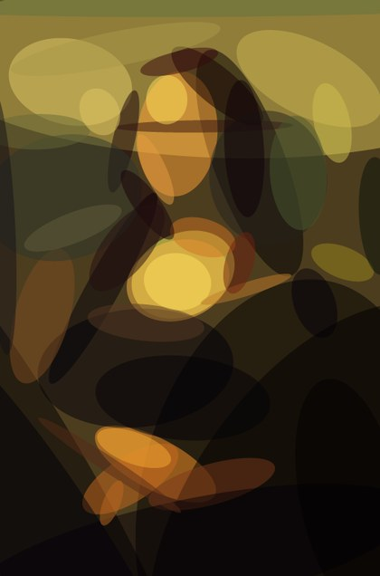
      </a>
      <br />
      <sub>SVG 9.2 KB</sub>
    </td>
    <td align="center">
      <a href="docs/readme/progression/monalisa/rotated-ellipse-200.svg">
        
      </a>
      <br />
      <sub>SVG 36.2 KB</sub>
    </td>
    <td align="center">
      <a href="docs/readme/progression/monalisa/rotated-ellipse-1000.svg">
        
      </a>
      <br />
      <sub>SVG 179.8 KB</sub>
    </td>
  </tr>
  <tr>
    <td><strong>Polygon</strong></td>
    <td align="center">
      <a href="docs/readme/progression/monalisa/polygon-50.svg">
        
      </a>
      <br />
      <sub>SVG 7.7 KB</sub>
    </td>
    <td align="center">
      <a href="docs/readme/progression/monalisa/polygon-200.svg">
        
      </a>
      <br />
      <sub>SVG 30.1 KB</sub>
    </td>
    <td align="center">
      <a href="docs/readme/progression/monalisa/polygon-1000.svg">
        
      </a>
      <br />
      <sub>SVG 150.0 KB</sub>
    </td>
  </tr>
</table>

### American Gothic

<p>
  <br />
  <sub>Original · JPG 80.6 KB</sub>
</p>

<table>
  <tr>
    <th align="left">Shape mode</th>
    <th align="center">50 steps</th>
    <th align="center">200 steps</th>
    <th align="center">1000 steps</th>
  </tr>
  <tr>
    <td><strong>Mixed</strong></td>
    <td align="center">
      <a href="docs/readme/progression/americangothic/any-50.svg">
        
      </a>
      <br />
      <sub>SVG 6.2 KB</sub>
    </td>
    <td align="center">
      <a href="docs/readme/progression/americangothic/any-200.svg">
        
      </a>
      <br />
      <sub>SVG 24.6 KB</sub>
    </td>
    <td align="center">
      <a href="docs/readme/progression/americangothic/any-1000.svg">
        
      </a>
      <br />
      <sub>SVG 128.8 KB</sub>
    </td>
  </tr>
  <tr>
    <td><strong>Triangle</strong></td>
    <td align="center">
      <a href="docs/readme/progression/americangothic/triangle-50.svg">
        
      </a>
      <br />
      <sub>SVG 4.6 KB</sub>
    </td>
    <td align="center">
      <a href="docs/readme/progression/americangothic/triangle-200.svg">
        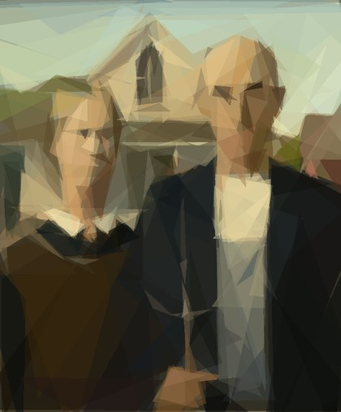
      </a>
      <br />
      <sub>SVG 18.0 KB</sub>
    </td>
    <td align="center">
      <a href="docs/readme/progression/americangothic/triangle-1000.svg">
        
      </a>
      <br />
      <sub>SVG 88.9 KB</sub>
    </td>
  </tr>
  <tr>
    <td><strong>Rectangle</strong></td>
    <td align="center">
      <a href="docs/readme/progression/americangothic/rectangle-50.svg">
        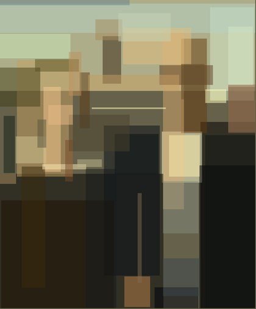
      </a>
      <br />
      <sub>SVG 4.9 KB</sub>
    </td>
    <td align="center">
      <a href="docs/readme/progression/americangothic/rectangle-200.svg">
        
      </a>
      <br />
      <sub>SVG 18.8 KB</sub>
    </td>
    <td align="center">
      <a href="docs/readme/progression/americangothic/rectangle-1000.svg">
        
      </a>
      <br />
      <sub>SVG 92.6 KB</sub>
    </td>
  </tr>
  <tr>
    <td><strong>Ellipse</strong></td>
    <td align="center">
      <a href="docs/readme/progression/americangothic/ellipse-50.svg">
        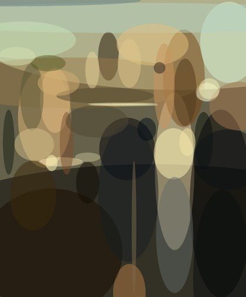
      </a>
      <br />
      <sub>SVG 4.8 KB</sub>
    </td>
    <td align="center">
      <a href="docs/readme/progression/americangothic/ellipse-200.svg">
        
      </a>
      <br />
      <sub>SVG 18.4 KB</sub>
    </td>
    <td align="center">
      <a href="docs/readme/progression/americangothic/ellipse-1000.svg">
        
      </a>
      <br />
      <sub>SVG 90.5 KB</sub>
    </td>
  </tr>
  <tr>
    <td><strong>Circle</strong></td>
    <td align="center">
      <a href="docs/readme/progression/americangothic/circle-50.svg">
        
      </a>
      <br />
      <sub>SVG 4.8 KB</sub>
    </td>
    <td align="center">
      <a href="docs/readme/progression/americangothic/circle-200.svg">
        
      </a>
      <br />
      <sub>SVG 18.3 KB</sub>
    </td>
    <td align="center">
      <a href="docs/readme/progression/americangothic/circle-1000.svg">
        
      </a>
      <br />
      <sub>SVG 90.3 KB</sub>
    </td>
  </tr>
  <tr>
    <td><strong>Rotated Rectangle</strong></td>
    <td align="center">
      <a href="docs/readme/progression/americangothic/rotated-rectangle-50.svg">
        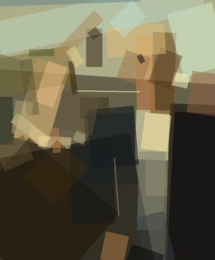
      </a>
      <br />
      <sub>SVG 7.9 KB</sub>
    </td>
    <td align="center">
      <a href="docs/readme/progression/americangothic/rotated-rectangle-200.svg">
        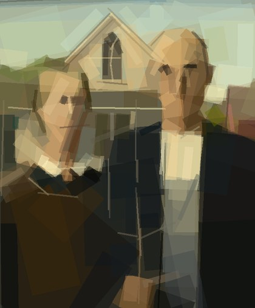
      </a>
      <br />
      <sub>SVG 31.1 KB</sub>
    </td>
    <td align="center">
      <a href="docs/readme/progression/americangothic/rotated-rectangle-1000.svg">
        
      </a>
      <br />
      <sub>SVG 154.1 KB</sub>
    </td>
  </tr>
  <tr>
    <td><strong>Quadratic</strong></td>
    <td align="center">
      <a href="docs/readme/progression/americangothic/quadratic-50.svg">
        
      </a>
      <br />
      <sub>SVG 8.5 KB</sub>
    </td>
    <td align="center">
      <a href="docs/readme/progression/americangothic/quadratic-200.svg">
        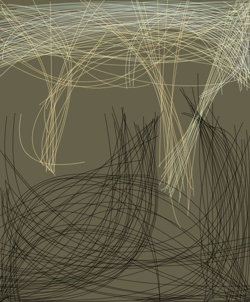
      </a>
      <br />
      <sub>SVG 33.5 KB</sub>
    </td>
    <td align="center">
      <a href="docs/readme/progression/americangothic/quadratic-1000.svg">
        
      </a>
      <br />
      <sub>SVG 166.5 KB</sub>
    </td>
  </tr>
  <tr>
    <td><strong>Rotated Ellipse</strong></td>
    <td align="center">
      <a href="docs/readme/progression/americangothic/rotated-ellipse-50.svg">
        
      </a>
      <br />
      <sub>SVG 9.2 KB</sub>
    </td>
    <td align="center">
      <a href="docs/readme/progression/americangothic/rotated-ellipse-200.svg">
        
      </a>
      <br />
      <sub>SVG 36.3 KB</sub>
    </td>
    <td align="center">
      <a href="docs/readme/progression/americangothic/rotated-ellipse-1000.svg">
        
      </a>
      <br />
      <sub>SVG 180.0 KB</sub>
    </td>
  </tr>
  <tr>
    <td><strong>Polygon</strong></td>
    <td align="center">
      <a href="docs/readme/progression/americangothic/polygon-50.svg">
        
      </a>
      <br />
      <sub>SVG 7.7 KB</sub>
    </td>
    <td align="center">
      <a href="docs/readme/progression/americangothic/polygon-200.svg">
        
      </a>
      <br />
      <sub>SVG 30.2 KB</sub>
    </td>
    <td align="center">
      <a href="docs/readme/progression/americangothic/polygon-1000.svg">
        
      </a>
      <br />
      <sub>SVG 150.4 KB</sub>
    </td>
  </tr>
</table>

### Fiume Po (M.Kenna)

<p>
  <br />
  <sub>Original · JPG 134.1 KB</sub>
</p>

<table>
  <tr>
    <th align="left">Shape mode</th>
    <th align="center">50 steps</th>
    <th align="center">200 steps</th>
    <th align="center">1000 steps</th>
  </tr>
  <tr>
    <td><strong>Mixed</strong></td>
    <td align="center">
      <a href="docs/readme/progression/kenna-fiume-po/any-50.svg">
        
      </a>
      <br />
      <sub>SVG 7.3 KB</sub>
    </td>
    <td align="center">
      <a href="docs/readme/progression/kenna-fiume-po/any-200.svg">
        
      </a>
      <br />
      <sub>SVG 27.9 KB</sub>
    </td>
    <td align="center">
      <a href="docs/readme/progression/kenna-fiume-po/any-1000.svg">
        
      </a>
      <br />
      <sub>SVG 141.8 KB</sub>
    </td>
  </tr>
  <tr>
    <td><strong>Triangle</strong></td>
    <td align="center">
      <a href="docs/readme/progression/kenna-fiume-po/triangle-50.svg">
        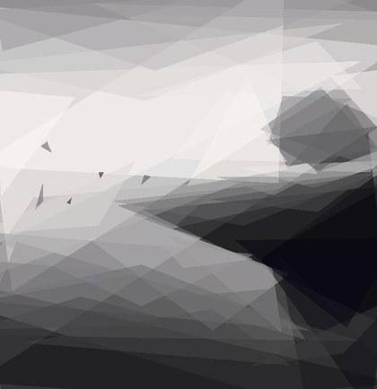
      </a>
      <br />
      <sub>SVG 4.7 KB</sub>
    </td>
    <td align="center">
      <a href="docs/readme/progression/kenna-fiume-po/triangle-200.svg">
        
      </a>
      <br />
      <sub>SVG 18.2 KB</sub>
    </td>
    <td align="center">
      <a href="docs/readme/progression/kenna-fiume-po/triangle-1000.svg">
        
      </a>
      <br />
      <sub>SVG 90.3 KB</sub>
    </td>
  </tr>
  <tr>
    <td><strong>Rectangle</strong></td>
    <td align="center">
      <a href="docs/readme/progression/kenna-fiume-po/rectangle-50.svg">
        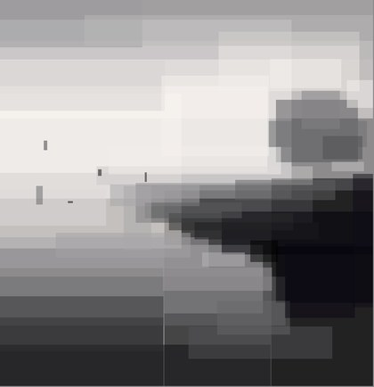
      </a>
      <br />
      <sub>SVG 4.9 KB</sub>
    </td>
    <td align="center">
      <a href="docs/readme/progression/kenna-fiume-po/rectangle-200.svg">
        
      </a>
      <br />
      <sub>SVG 18.9 KB</sub>
    </td>
    <td align="center">
      <a href="docs/readme/progression/kenna-fiume-po/rectangle-1000.svg">
        
      </a>
      <br />
      <sub>SVG 93.1 KB</sub>
    </td>
  </tr>
  <tr>
    <td><strong>Ellipse</strong></td>
    <td align="center">
      <a href="docs/readme/progression/kenna-fiume-po/ellipse-50.svg">
        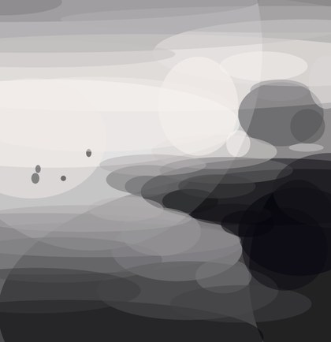
      </a>
      <br />
      <sub>SVG 4.8 KB</sub>
    </td>
    <td align="center">
      <a href="docs/readme/progression/kenna-fiume-po/ellipse-200.svg">
        
      </a>
      <br />
      <sub>SVG 18.5 KB</sub>
    </td>
    <td align="center">
      <a href="docs/readme/progression/kenna-fiume-po/ellipse-1000.svg">
        
      </a>
      <br />
      <sub>SVG 91.0 KB</sub>
    </td>
  </tr>
  <tr>
    <td><strong>Circle</strong></td>
    <td align="center">
      <a href="docs/readme/progression/kenna-fiume-po/circle-50.svg">
        
      </a>
      <br />
      <sub>SVG 4.8 KB</sub>
    </td>
    <td align="center">
      <a href="docs/readme/progression/kenna-fiume-po/circle-200.svg">
        
      </a>
      <br />
      <sub>SVG 18.5 KB</sub>
    </td>
    <td align="center">
      <a href="docs/readme/progression/kenna-fiume-po/circle-1000.svg">
        
      </a>
      <br />
      <sub>SVG 90.8 KB</sub>
    </td>
  </tr>
  <tr>
    <td><strong>Rotated Rectangle</strong></td>
    <td align="center">
      <a href="docs/readme/progression/kenna-fiume-po/rotated-rectangle-50.svg">
        
      </a>
      <br />
      <sub>SVG 8.0 KB</sub>
    </td>
    <td align="center">
      <a href="docs/readme/progression/kenna-fiume-po/rotated-rectangle-200.svg">
        
      </a>
      <br />
      <sub>SVG 31.2 KB</sub>
    </td>
    <td align="center">
      <a href="docs/readme/progression/kenna-fiume-po/rotated-rectangle-1000.svg">
        
      </a>
      <br />
      <sub>SVG 154.4 KB</sub>
    </td>
  </tr>
  <tr>
    <td><strong>Quadratic</strong></td>
    <td align="center">
      <a href="docs/readme/progression/kenna-fiume-po/quadratic-50.svg">
        
      </a>
      <br />
      <sub>SVG 8.6 KB</sub>
    </td>
    <td align="center">
      <a href="docs/readme/progression/kenna-fiume-po/quadratic-200.svg">
        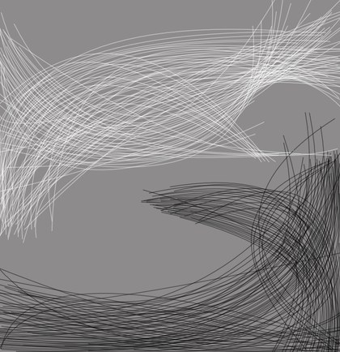
      </a>
      <br />
      <sub>SVG 33.5 KB</sub>
    </td>
    <td align="center">
      <a href="docs/readme/progression/kenna-fiume-po/quadratic-1000.svg">
        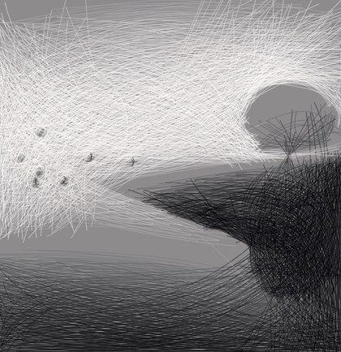
      </a>
      <br />
      <sub>SVG 167.1 KB</sub>
    </td>
  </tr>
  <tr>
    <td><strong>Rotated Ellipse</strong></td>
    <td align="center">
      <a href="docs/readme/progression/kenna-fiume-po/rotated-ellipse-50.svg">
        
      </a>
      <br />
      <sub>SVG 9.2 KB</sub>
    </td>
    <td align="center">
      <a href="docs/readme/progression/kenna-fiume-po/rotated-ellipse-200.svg">
        
      </a>
      <br />
      <sub>SVG 36.3 KB</sub>
    </td>
    <td align="center">
      <a href="docs/readme/progression/kenna-fiume-po/rotated-ellipse-1000.svg">
        
      </a>
      <br />
      <sub>SVG 180.5 KB</sub>
    </td>
  </tr>
  <tr>
    <td><strong>Polygon</strong></td>
    <td align="center">
      <a href="docs/readme/progression/kenna-fiume-po/polygon-50.svg">
        
      </a>
      <br />
      <sub>SVG 7.8 KB</sub>
    </td>
    <td align="center">
      <a href="docs/readme/progression/kenna-fiume-po/polygon-200.svg">
        
      </a>
      <br />
      <sub>SVG 30.6 KB</sub>
    </td>
    <td align="center">
      <a href="docs/readme/progression/kenna-fiume-po/polygon-1000.svg">
        
      </a>
      <br />
      <sub>SVG 152.1 KB</sub>
    </td>
  </tr>
</table>

### Spongebob

<p>
  <br />
  <sub>Original · JPG 51.3 KB</sub>
</p>

<table>
  <tr>
    <th align="left">Shape mode</th>
    <th align="center">50 steps</th>
    <th align="center">200 steps</th>
    <th align="center">1000 steps</th>
  </tr>
  <tr>
    <td><strong>Mixed</strong></td>
    <td align="center">
      <a href="docs/readme/progression/spongebob/any-50.svg">
        
      </a>
      <br />
      <sub>SVG 6.4 KB</sub>
    </td>
    <td align="center">
      <a href="docs/readme/progression/spongebob/any-200.svg">
        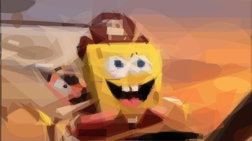
      </a>
      <br />
      <sub>SVG 25.4 KB</sub>
    </td>
    <td align="center">
      <a href="docs/readme/progression/spongebob/any-1000.svg">
        
      </a>
      <br />
      <sub>SVG 130.2 KB</sub>
    </td>
  </tr>
  <tr>
    <td><strong>Triangle</strong></td>
    <td align="center">
      <a href="docs/readme/progression/spongebob/triangle-50.svg">
        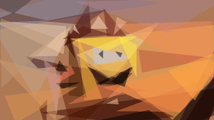
      </a>
      <br />
      <sub>SVG 4.6 KB</sub>
    </td>
    <td align="center">
      <a href="docs/readme/progression/spongebob/triangle-200.svg">
        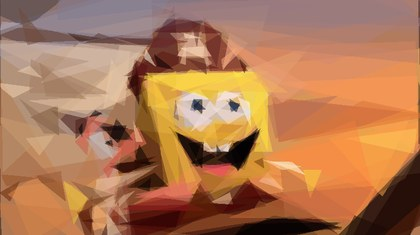
      </a>
      <br />
      <sub>SVG 17.9 KB</sub>
    </td>
    <td align="center">
      <a href="docs/readme/progression/spongebob/triangle-1000.svg">
        
      </a>
      <br />
      <sub>SVG 88.6 KB</sub>
    </td>
  </tr>
  <tr>
    <td><strong>Rectangle</strong></td>
    <td align="center">
      <a href="docs/readme/progression/spongebob/rectangle-50.svg">
        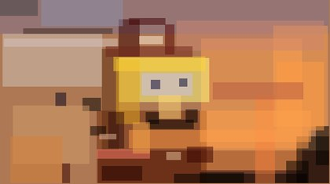
      </a>
      <br />
      <sub>SVG 4.8 KB</sub>
    </td>
    <td align="center">
      <a href="docs/readme/progression/spongebob/rectangle-200.svg">
        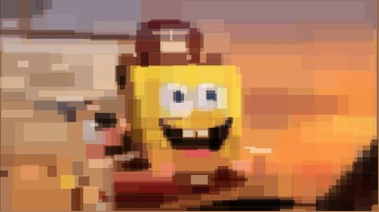
      </a>
      <br />
      <sub>SVG 18.7 KB</sub>
    </td>
    <td align="center">
      <a href="docs/readme/progression/spongebob/rectangle-1000.svg">
        
      </a>
      <br />
      <sub>SVG 92.4 KB</sub>
    </td>
  </tr>
  <tr>
    <td><strong>Ellipse</strong></td>
    <td align="center">
      <a href="docs/readme/progression/spongebob/ellipse-50.svg">
        
      </a>
      <br />
      <sub>SVG 4.7 KB</sub>
    </td>
    <td align="center">
      <a href="docs/readme/progression/spongebob/ellipse-200.svg">
        
      </a>
      <br />
      <sub>SVG 18.3 KB</sub>
    </td>
    <td align="center">
      <a href="docs/readme/progression/spongebob/ellipse-1000.svg">
        
      </a>
      <br />
      <sub>SVG 90.2 KB</sub>
    </td>
  </tr>
  <tr>
    <td><strong>Circle</strong></td>
    <td align="center">
      <a href="docs/readme/progression/spongebob/circle-50.svg">
        
      </a>
      <br />
      <sub>SVG 4.7 KB</sub>
    </td>
    <td align="center">
      <a href="docs/readme/progression/spongebob/circle-200.svg">
        
      </a>
      <br />
      <sub>SVG 18.3 KB</sub>
    </td>
    <td align="center">
      <a href="docs/readme/progression/spongebob/circle-1000.svg">
        
      </a>
      <br />
      <sub>SVG 90.1 KB</sub>
    </td>
  </tr>
  <tr>
    <td><strong>Rotated Rectangle</strong></td>
    <td align="center">
      <a href="docs/readme/progression/spongebob/rotated-rectangle-50.svg">
        
      </a>
      <br />
      <sub>SVG 7.9 KB</sub>
    </td>
    <td align="center">
      <a href="docs/readme/progression/spongebob/rotated-rectangle-200.svg">
        
      </a>
      <br />
      <sub>SVG 31.0 KB</sub>
    </td>
    <td align="center">
      <a href="docs/readme/progression/spongebob/rotated-rectangle-1000.svg">
        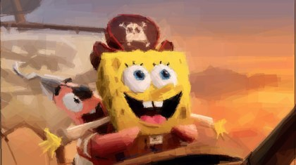
      </a>
      <br />
      <sub>SVG 153.8 KB</sub>
    </td>
  </tr>
  <tr>
    <td><strong>Quadratic</strong></td>
    <td align="center">
      <a href="docs/readme/progression/spongebob/quadratic-50.svg">
        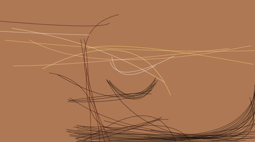
      </a>
      <br />
      <sub>SVG 8.5 KB</sub>
    </td>
    <td align="center">
      <a href="docs/readme/progression/spongebob/quadratic-200.svg">
        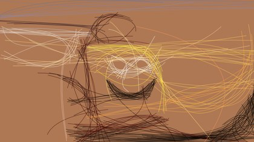
      </a>
      <br />
      <sub>SVG 33.4 KB</sub>
    </td>
    <td align="center">
      <a href="docs/readme/progression/spongebob/quadratic-1000.svg">
        
      </a>
      <br />
      <sub>SVG 166.0 KB</sub>
    </td>
  </tr>
  <tr>
    <td><strong>Rotated Ellipse</strong></td>
    <td align="center">
      <a href="docs/readme/progression/spongebob/rotated-ellipse-50.svg">
        
      </a>
      <br />
      <sub>SVG 9.2 KB</sub>
    </td>
    <td align="center">
      <a href="docs/readme/progression/spongebob/rotated-ellipse-200.svg">
        
      </a>
      <br />
      <sub>SVG 36.2 KB</sub>
    </td>
    <td align="center">
      <a href="docs/readme/progression/spongebob/rotated-ellipse-1000.svg">
        
      </a>
      <br />
      <sub>SVG 179.8 KB</sub>
    </td>
  </tr>
  <tr>
    <td><strong>Polygon</strong></td>
    <td align="center">
      <a href="docs/readme/progression/spongebob/polygon-50.svg">
        
      </a>
      <br />
      <sub>SVG 7.7 KB</sub>
    </td>
    <td align="center">
      <a href="docs/readme/progression/spongebob/polygon-200.svg">
        
      </a>
      <br />
      <sub>SVG 30.2 KB</sub>
    </td>
    <td align="center">
      <a href="docs/readme/progression/spongebob/polygon-1000.svg">
        
      </a>
      <br />
      <sub>SVG 150.0 KB</sub>
    </td>
  </tr>
</table>

## Benchmarks

Using `docs/readme/originals/americangothic.jpg` as the input image, `500` steps per run, and all nine shape modes (`any`, triangle, rectangle, ellipse, circle, rotated rectangle, quadratic, rotated ellipse, polygon), the Rust CLI completed the full matrix in **`1m 18s`** versus **`2m 41s`** for the original Go CLI from [`fogleman/primitive`](https://github.com/fogleman/primitive).

That works out to a **`2.06x` speedup overall** (`51.5%` less total time). On this run, Rust was **faster in all 9 modes** and delivered **`4.0%` lower average RMSE** overall (`15.97` vs `16.63`). It also produced lower RMSE in 7 of the 9 individual modes.

| Shape | Rust time | Go time | Speedup | Rust RMSE | Go RMSE |
| --- | ---: | ---: | ---: | ---: | ---: |
| Mixed | 7.57s | 14.64s | 1.93x | 12.27 | 13.57 |
| Triangle | 4.03s | 9.13s | 2.27x | 14.38 | 14.64 |
| Rectangle | 2.53s | 7.06s | 2.80x | 15.23 | 14.55 |
| Ellipse | 5.56s | 18.17s | 3.27x | 12.34 | 12.57 |
| Circle | 7.59s | 21.68s | 2.86x | 14.23 | 14.46 |
| Rotated rectangle | 4.54s | 9.58s | 2.11x | 12.82 | 14.12 |
| Quadratic | 6.06s | 23.24s | 3.84x | 39.53 | 38.27 |
| Rotated ellipse | 24.78s | 39.38s | 1.59x | 11.79 | 13.82 |
| Polygon | 15.17s | 17.68s | 1.17x | 11.13 | 13.66 |

*Lower RMSE is better.* Times are from a single local benchmark run and will vary by machine. The upstream Go CLI does not expose a fixed seed flag, so the quality comparison reflects one representative run rather than a deterministic seed-matched replay.

## Usage in the Wild

Real projects using `primitive` beyond demos and benchmarks:

- [nudaluce.com](https://nudaluce.com) *(NSFW)* — my photography website uses `primitive`-generated SVGs as **LQIPs** (low-quality image placeholders), replacing the more typical blurred-image placeholder technique with geometric previews.

> **Want your project listed here?** Send an email to [ale.burato@icloud.com](mailto:ale.burato@icloud.com) with the URL of the related resource.

## Development

Run the standard Rust quality gates from the repository root:

```bash
cargo fmt --check
cargo clippy --all-targets -- -D warnings
cargo test
```

The comparison harness lives at [`scripts/benchmark.py`](scripts/benchmark.py). It can compare any two compatible binaries and writes reports to `output/`.

## License

Released under the [MIT License](LICENSE).
