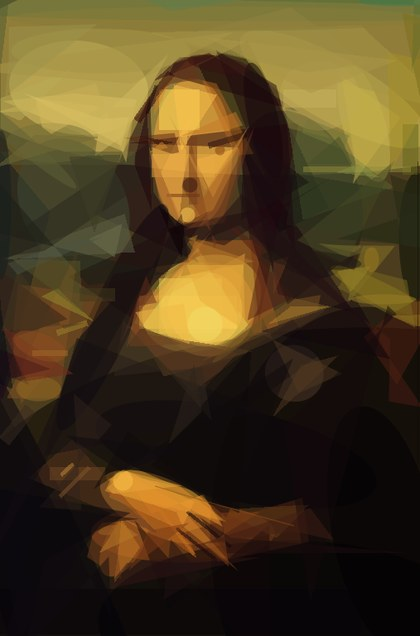
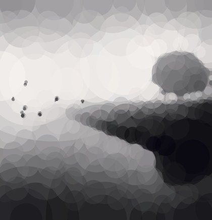

# primeval

`primeval` turns photos and artwork into **stylized reconstructions built from simple geometric shapes**.

Give it an input image and it searches for a layered approximation you can export as **PNG, JPG, GIF, or clean SVG** output.

<!-- markdownlint-disable MD033 -->

<table>
  <tr>
    <td align="center"></td>
    <td align="center"></td>
    <td align="center"></td>
    <td align="center"></td>
  </tr>
  <tr>
    <td align="center"><sub>Mona Lisa · mixed · 200 steps</sub></td>
    <td align="center"><sub>Mona Lisa · quadratic · 1000 steps</sub></td>
    <td align="center"><sub>American Gothic · polygon · 50 steps</sub></td>
    <td align="center"><sub>Fiume Po (M.Kenna) · circle · 200 steps</sub></td>
  </tr>
</table>

Inspired by Michael Fogleman's original [`primitive`](https://github.com/fogleman/primitive), this repository is an **independent Rust implementation** with a reusable core library (`primeval-core`), a CLI (`primeval-cli`), and an ESM-only Node package (`@aleburato/primeval`).

## Progression Gallery

Browse the full example gallery in [`docs/gallery.md`](docs/gallery.md).

## Highlights

- Fast hill-climbing search with multi-threaded worker contexts
- Nine shape modes in the CLI: mixed (`any`), triangle, rectangle, ellipse, circle, rotated rectangle, quadratic curve, rotated ellipse, and polygon
- Small working-resolution optimization with high-resolution output replay
- Vector export via SVG, plus raster output for PNG, JPG, and animated GIFs

## Install

### Node package

```bash
npm install @aleburato/primeval
```

Prebuilt native addons are provided for macOS (arm64, x64), Linux (arm64, x64), and Windows (x64). Node 20+ is required.

### CLI from source

Clone the repository and build the release binary:

```bash
git clone git@github.com:aleburato/primeval.git
cd primeval
cargo build --release
```

Or install the CLI directly:

```bash
cargo install --path crates/primeval-cli
```

## Quick Start

Run the CLI against one of the bundled README originals:

```bash
./target/release/primeval-cli run \
  docs/readme/originals/monalisa.jpg \
  --output output/monalisa.png \
  --emit png,svg \
  --count 1000
```

Useful options:

- `--shape any|triangle|rectangle|ellipse|circle|rotated-rectangle|quadratic|rotated-ellipse|polygon` with `any` as the default
- `--count <N>` number of optimization steps (default `100`)
- `--alpha <N>|auto` shape opacity, `1`..`255` or `auto` (default `128`)
- `--resize-input <N>` working resolution (default `256`)
- `--output-size <N>` final replay resolution (default `1024`)
- `--repeat <N>` extra candidates per step (default `0`)
- `--threads <N>` worker thread count (defaults to available cores)
- `--seed <N>` for deterministic output
- `--emit png,jpg,svg,gif` one or more output formats

See the full CLI help with:

```bash
./target/release/primeval-cli run --help
```

## Node Package

The npm package is **ESM-only** and targets **Node 20+**.

```js
import { approximate } from "@aleburato/primeval";
import { readFile } from "node:fs/promises";

const input = await readFile("docs/readme/originals/monalisa.jpg");

const result = await approximate({
  input: { kind: "bytes", data: input },
  output: "svg",
  render: {
    count: 300,
    shape: "any",
  },
});

console.log(result.format, result.width, result.height);
console.log(result.data.slice(0, 32));
```

`approximate()` accepts:

- `input` (required): `{ kind: "bytes", data: Buffer | Uint8Array }` or `{ kind: "path", path: string }`
- `output` (required): `"svg" | "png" | "jpg" | "gif"`
- `render` (optional): render options forwarded to Rust; omitted fields use Rust defaults
- `execution` (optional): progress and cancellation controls

Render options:

- `count?: number` optimization steps. Default: `100`.
- `shape?: "any" | "triangle" | "rectangle" | "ellipse" | "circle" | "rotated-rectangle" | "quadratic" | "rotated-ellipse" | "polygon"`. Default: `"any"`.
- `alpha?: number | "auto"` shape opacity. Accepted values: `1..255` or `"auto"`. Default: `128`.
- `repeat?: number` extra candidates per step. Default: `0`.
- `seed?: number` deterministic RNG seed. Omit it to let Rust choose a non-deterministic seed.
- `background?: "auto" | string` background color. Use `"auto"` or a hex color in `RGB`, `RGBA`, `RRGGBB`, or `RRGGBBAA` form, with optional leading `#`. Default: `"auto"`.
- `resizeInput?: number` working resolution. Default: `256`.
- `outputSize?: number` final replay resolution. Default: `1024`.

Execution options:

- `onProgress?: (info) => void` receives `{ step, total, score }` once per optimization step.
- `signal?: AbortSignal` cancels an in-flight render and rejects with `AbortError`.

Convert results to a data URI:

```js
import { approximate, toDataUri } from "@aleburato/primeval";
import { readFile } from "node:fs/promises";

const input = await readFile("docs/readme/originals/monalisa.jpg");
const result = await approximate({
  input: { kind: "bytes", data: input },
  output: "png",
  render: { count: 200 },
});

const uri = toDataUri(result);
console.log(uri.slice(0, 64));
```

Abort long renders with `AbortSignal`:

```js
import { AbortError, approximate } from "@aleburato/primeval";
import { readFile } from "node:fs/promises";

const controller = new AbortController();
const input = await readFile("docs/readme/originals/monalisa.jpg");

try {
  const promise = approximate({
    input: { kind: "bytes", data: input },
    output: "svg",
    render: { count: 1000 },
    execution: {
      signal: controller.signal,
      onProgress(info) {
        if (info.step === 10) {
          controller.abort();
        }
      },
    },
  });

  await promise;
} catch (error) {
  if (error instanceof AbortError) {
    console.log("render aborted");
  } else {
    throw error;
  }
}
```

Package notes:

- Missing `render` fields are forwarded to Rust and resolved there; the package does not reinvent render defaults in TypeScript.
- Default render options from Rust are `count: 100`, `shape: "any"`, `alpha: 128`, `repeat: 0`, `seed: None`, `background: "auto"`, `resizeInput: 256`, and `outputSize: 1024`.
- `approximate()` returns exactly one output format per call: `svg`, `png`, `jpg`, or `gif`.
- The default shape is `any` (mixed); all nine CLI shape modes are available.
- Errors are mapped to `ValidationError`, `NotFoundError`, and `AbortError` — use `instanceof` to distinguish them.
- For SVG results, `data` is a `string`; for raster results, `data` is a `Buffer`.

## CLI Reference

`primeval-cli run` accepts:

- `input` (required positional): input image path
- `--output <PATH>` (required): output path, or `-` for stdout
- `--emit png,jpg,svg,gif` optional comma-separated output formats. If omitted, the CLI infers one format from `--output`; `--output -` defaults to `svg`.
- `--count <N>` optimization steps. Default: `100`.
- `--shape any|triangle|rectangle|ellipse|circle|rotated-rectangle|quadratic|rotated-ellipse|polygon`. Default: `any`.
- `--alpha <N>|auto` shape opacity. Accepted values: `1..255` or `auto`. Default: `128`.
- `--background <VALUE>` background color. Use `auto` or a hex color in `RGB`, `RGBA`, `RRGGBB`, or `RRGGBBAA` form, with optional leading `#`. Default: `auto`.
- `--resize-input <N>` working resolution. Default: `256`.
- `--output-size <N>` final replay resolution. Default: `1024`.
- `--repeat <N>` extra candidates per step. Default: `0`.
- `--threads <N>` worker thread count. Default: available cores.
- `--seed <N>` deterministic RNG seed. If omitted, the CLI generates one from the system clock.
- `--save-every <N>` GIF frame cadence. Default: `1`.
- `--progress auto|plain|off` progress reporting mode. Default: `auto`.

CLI notes:

- `--output -` supports exactly one emitted format.
- GIF output to stdout is not supported.

## Benchmarks

Using `docs/readme/originals/americangothic.jpg` as the input image, `500` steps per run, and all nine shape modes (`any`, triangle, rectangle, ellipse, circle, rotated rectangle, quadratic, rotated ellipse, polygon), the Rust CLI completed the full matrix in **`1m 18s`** versus **`2m 41s`** for the original Go CLI from [`fogleman/primitive`](https://github.com/fogleman/primitive).

That works out to a **`2.06x` speedup overall** (`51.5%` less total time). On this run, Rust was **faster in all 9 modes** and delivered **`4.0%` lower average RMSE** overall (`15.97` vs `16.63`). It also produced lower RMSE in 7 of the 9 individual modes.

| Shape | Rust time | Go time | Speedup | Rust RMSE | Go RMSE |
| --- | ---: | ---: | ---: | ---: | ---: |
| Mixed | 7.6s | 14.6s | 1.9x | 12.3 | 13.6 |
| Triangle | 4.0s | 9.1s | 2.3x | 14.4 | 14.6 |
| Rectangle | 2.5s | 7.1s | 2.8x | 15.2 | 14.6 |
| Ellipse | 5.6s | 18.2s | 3.3x | 12.3 | 12.6 |
| Circle | 7.6s | 21.7s | 2.9x | 14.2 | 14.5 |
| Rotated rectangle | 4.5s | 9.6s | 2.1x | 12.8 | 14.1 |
| Quadratic | 6.1s | 23.2s | 3.8x | 39.5 | 38.3 |
| Rotated ellipse | 24.8s | 39.4s | 1.6x | 11.8 | 13.8 |
| Polygon | 15.2s | 17.7s | 1.2x | 11.1 | 13.7 |

*Lower RMSE is better.* Times are from a single local benchmark run and will vary by machine. The upstream Go CLI does not expose a fixed seed flag, so the quality comparison reflects one representative run rather than a deterministic seed-matched replay.

## Usage in the Wild

Real projects using `primeval` beyond demos and benchmarks:

- [nudaluce.com](https://nudaluce.com) *(NSFW)* — my photography website uses `primeval`-generated SVGs as **LQIPs** (low-quality image placeholders), replacing the more typical blurred-image placeholder technique with geometric previews.

> **Want your project listed here?** Send an email to [ale.burato@icloud.com](mailto:ale.burato@icloud.com) with the URL of the related resource.

## Development

Run the standard quality gates from the repository root:

```bash
# Rust
cargo fmt --check
cargo clippy --all-targets -- -D warnings
cargo test

# Node / package
npm run typecheck
npm test
npm run test:tooling
npm pack --dry-run
```

`npm test` builds the TypeScript wrapper and native addon before running the full package test suite, including the native-path tests.

For local development when you want the native build step by itself:

```bash
npm ci
npm run test:native:build
npm run test:native
```

The comparison harness lives at [`scripts/benchmark.py`](scripts/benchmark.py). It can compare any two compatible binaries and writes reports to `output/`.

## License

Released under the [MIT License](LICENSE).
