# Progression Gallery

<!-- markdownlint-disable MD033 -->

Each table below shows one original image, with shape modes in rows and step counts in columns. Every preview is a JPEG thumbnail that links to the generated SVG.

### Mona Lisa

   
  Original · JPG 149.5 KB

<table>
  <tr>
    <th align="left">Shape mode</th>
    <th align="center">50 steps</th>
    <th align="center">200 steps</th>
    <th align="center">1000 steps</th>
  </tr>
  <tr>
    <td><strong>Mixed</strong></td>
    <td align="center">
      
       
      SVG 6.9 KB
    </td>
    <td align="center">
      
       
      SVG 26.0 KB
    </td>
    <td align="center">
      
       
      SVG 135.0 KB
    </td>
  </tr>
  <tr>
    <td><strong>Triangle</strong></td>
    <td align="center">
      
       
      SVG 4.6 KB
    </td>
    <td align="center">
      <a href="images/progression/monalisa/triangle-200.svg">
        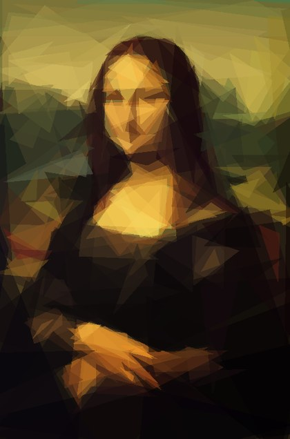
      </a>
       
      SVG 17.9 KB
    </td>
    <td align="center">
      
       
      SVG 88.5 KB
    </td>
  </tr>
  <tr>
    <td><strong>Rectangle</strong></td>
    <td align="center">
      
       
      SVG 4.9 KB
    </td>
    <td align="center">
      
       
      SVG 18.8 KB
    </td>
    <td align="center">
      
       
      SVG 92.5 KB
    </td>
  </tr>
  <tr>
    <td><strong>Ellipse</strong></td>
    <td align="center">
      
       
      SVG 4.8 KB
    </td>
    <td align="center">
      
       
      SVG 18.3 KB
    </td>
    <td align="center">
      <a href="images/progression/monalisa/ellipse-1000.svg">
        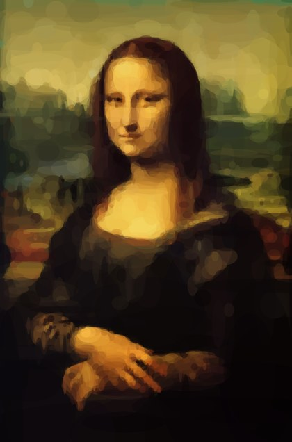
      </a>
       
      SVG 90.2 KB
    </td>
  </tr>
  <tr>
    <td><strong>Circle</strong></td>
    <td align="center">
      
       
      SVG 4.8 KB
    </td>
    <td align="center">
      
       
      SVG 18.3 KB
    </td>
    <td align="center">
      
       
      SVG 90.1 KB
    </td>
  </tr>
  <tr>
    <td><strong>Rotated Rectangle</strong></td>
    <td align="center">
      <a href="images/progression/monalisa/rotated-rectangle-50.svg">
        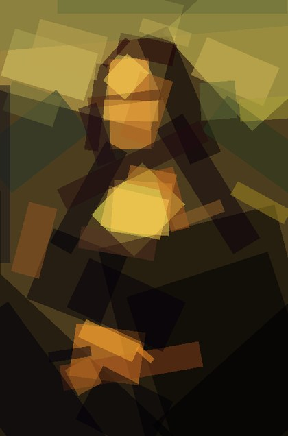
      </a>
       
      SVG 7.9 KB
    </td>
    <td align="center">
      
       
      SVG 31.1 KB
    </td>
    <td align="center">
      
       
      SVG 153.9 KB
    </td>
  </tr>
  <tr>
    <td><strong>Quadratic</strong></td>
    <td align="center">
      <a href="images/progression/monalisa/quadratic-50.svg">
        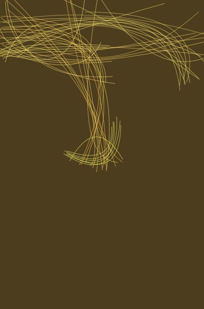
      </a>
       
      SVG 8.4 KB
    </td>
    <td align="center">
      <a href="images/progression/monalisa/quadratic-200.svg">
        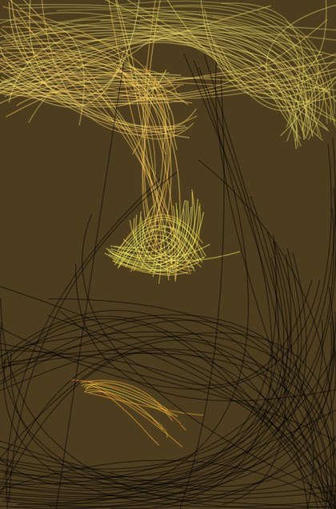
      </a>
       
      SVG 33.3 KB
    </td>
    <td align="center">
      
       
      SVG 165.9 KB
    </td>
  </tr>
  <tr>
    <td><strong>Rotated Ellipse</strong></td>
    <td align="center">
      
       
      SVG 9.2 KB
    </td>
    <td align="center">
      
       
      SVG 36.2 KB
    </td>
    <td align="center">
      
       
      SVG 179.8 KB
    </td>
  </tr>
  <tr>
    <td><strong>Polygon</strong></td>
    <td align="center">
      
       
      SVG 7.7 KB
    </td>
    <td align="center">
      <a href="images/progression/monalisa/polygon-200.svg">
        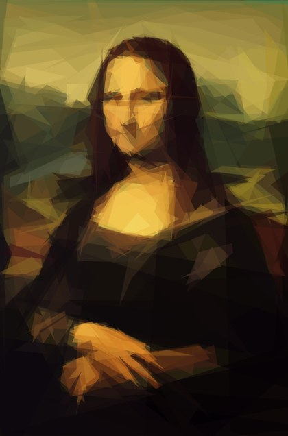
      </a>
       
      SVG 30.1 KB
    </td>
    <td align="center">
      
       
      SVG 150.0 KB
    </td>
  </tr>
</table>

### American Gothic

   
  Original · JPG 80.6 KB

<table>
  <tr>
    <th align="left">Shape mode</th>
    <th align="center">50 steps</th>
    <th align="center">200 steps</th>
    <th align="center">1000 steps</th>
  </tr>
  <tr>
    <td><strong>Mixed</strong></td>
    <td align="center">
      
       
      SVG 6.2 KB
    </td>
    <td align="center">
      
       
      SVG 24.6 KB
    </td>
    <td align="center">
      <a href="images/progression/americangothic/any-1000.svg">
        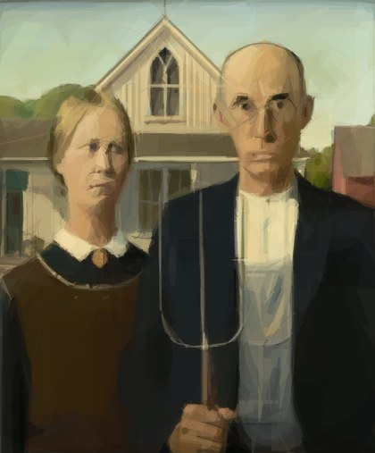
      </a>
       
      SVG 128.8 KB
    </td>
  </tr>
  <tr>
    <td><strong>Triangle</strong></td>
    <td align="center">
      
       
      SVG 4.6 KB
    </td>
    <td align="center">
      
       
      SVG 18.0 KB
    </td>
    <td align="center">
      
       
      SVG 88.9 KB
    </td>
  </tr>
  <tr>
    <td><strong>Rectangle</strong></td>
    <td align="center">
      
       
      SVG 4.9 KB
    </td>
    <td align="center">
      
       
      SVG 18.8 KB
    </td>
    <td align="center">
      
       
      SVG 92.6 KB
    </td>
  </tr>
  <tr>
    <td><strong>Ellipse</strong></td>
    <td align="center">
      
       
      SVG 4.8 KB
    </td>
    <td align="center">
      
       
      SVG 18.4 KB
    </td>
    <td align="center">
      
       
      SVG 90.5 KB
    </td>
  </tr>
  <tr>
    <td><strong>Circle</strong></td>
    <td align="center">
      
       
      SVG 4.8 KB
    </td>
    <td align="center">
      
       
      SVG 18.3 KB
    </td>
    <td align="center">
      
       
      SVG 90.3 KB
    </td>
  </tr>
  <tr>
    <td><strong>Rotated Rectangle</strong></td>
    <td align="center">
      
       
      SVG 7.9 KB
    </td>
    <td align="center">
      
       
      SVG 31.1 KB
    </td>
    <td align="center">
      
       
      SVG 154.1 KB
    </td>
  </tr>
  <tr>
    <td><strong>Quadratic</strong></td>
    <td align="center">
      <a href="images/progression/americangothic/quadratic-50.svg">
        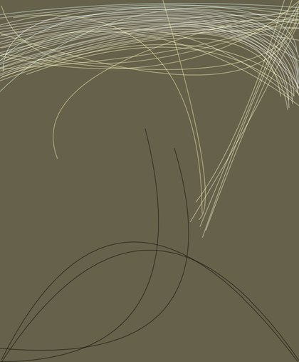
      </a>
       
      SVG 8.5 KB
    </td>
    <td align="center">
      
       
      SVG 33.5 KB
    </td>
    <td align="center">
      <a href="images/progression/americangothic/quadratic-1000.svg">
        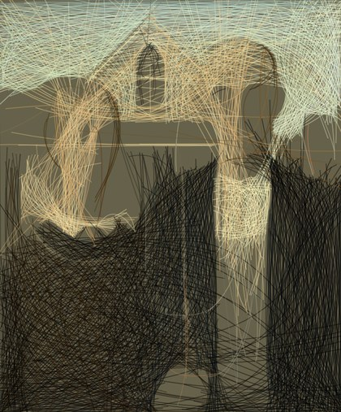
      </a>
       
      SVG 166.5 KB
    </td>
  </tr>
  <tr>
    <td><strong>Rotated Ellipse</strong></td>
    <td align="center">
      <a href="images/progression/americangothic/rotated-ellipse-50.svg">
        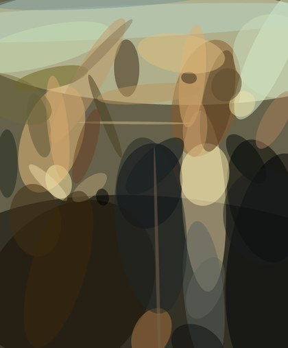
      </a>
       
      SVG 9.2 KB
    </td>
    <td align="center">
      
       
      SVG 36.3 KB
    </td>
    <td align="center">
      
       
      SVG 180.0 KB
    </td>
  </tr>
  <tr>
    <td><strong>Polygon</strong></td>
    <td align="center">
      
       
      SVG 7.7 KB
    </td>
    <td align="center">
      
       
      SVG 30.2 KB
    </td>
    <td align="center">
      
       
      SVG 150.4 KB
    </td>
  </tr>
</table>

### Fiume Po (M.Kenna)

   
  Original · JPG 134.1 KB

<table>
  <tr>
    <th align="left">Shape mode</th>
    <th align="center">50 steps</th>
    <th align="center">200 steps</th>
    <th align="center">1000 steps</th>
  </tr>
  <tr>
    <td><strong>Mixed</strong></td>
    <td align="center">
      <a href="images/progression/kenna-fiume-po/any-50.svg">
        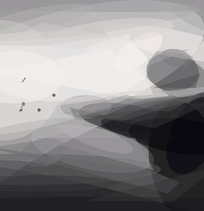
      </a>
       
      SVG 7.3 KB
    </td>
    <td align="center">
      
       
      SVG 27.9 KB
    </td>
    <td align="center">
      
       
      SVG 141.8 KB
    </td>
  </tr>
  <tr>
    <td><strong>Triangle</strong></td>
    <td align="center">
      
       
      SVG 4.7 KB
    </td>
    <td align="center">
      <a href="images/progression/kenna-fiume-po/triangle-200.svg">
        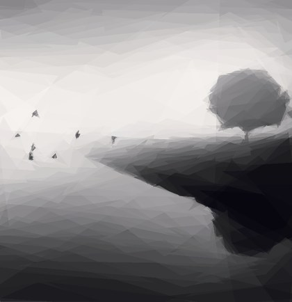
      </a>
       
      SVG 18.2 KB
    </td>
    <td align="center">
      
       
      SVG 90.3 KB
    </td>
  </tr>
  <tr>
    <td><strong>Rectangle</strong></td>
    <td align="center">
      
       
      SVG 4.9 KB
    </td>
    <td align="center">
      
       
      SVG 18.9 KB
    </td>
    <td align="center">
      
       
      SVG 93.1 KB
    </td>
  </tr>
  <tr>
    <td><strong>Ellipse</strong></td>
    <td align="center">
      
       
      SVG 4.8 KB
    </td>
    <td align="center">
      
       
      SVG 18.5 KB
    </td>
    <td align="center">
      
       
      SVG 91.0 KB
    </td>
  </tr>
  <tr>
    <td><strong>Circle</strong></td>
    <td align="center">
      <a href="images/progression/kenna-fiume-po/circle-50.svg">
        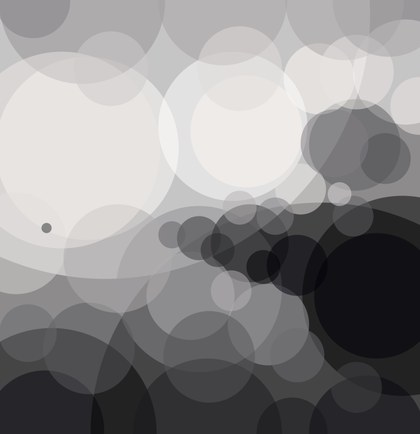
      </a>
       
      SVG 4.8 KB
    </td>
    <td align="center">
      
       
      SVG 18.5 KB
    </td>
    <td align="center">
      
       
      SVG 90.8 KB
    </td>
  </tr>
  <tr>
    <td><strong>Rotated Rectangle</strong></td>
    <td align="center">
      <a href="images/progression/kenna-fiume-po/rotated-rectangle-50.svg">
        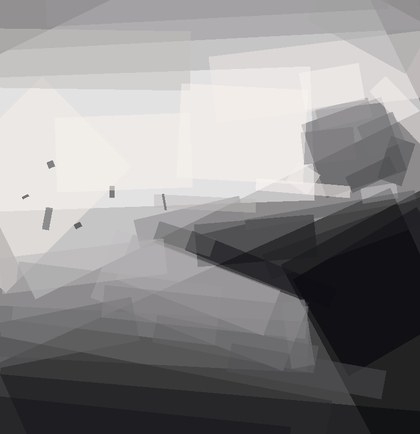
      </a>
       
      SVG 8.0 KB
    </td>
    <td align="center">
      
       
      SVG 31.2 KB
    </td>
    <td align="center">
      
       
      SVG 154.4 KB
    </td>
  </tr>
  <tr>
    <td><strong>Quadratic</strong></td>
    <td align="center">
      <a href="images/progression/kenna-fiume-po/quadratic-50.svg">
        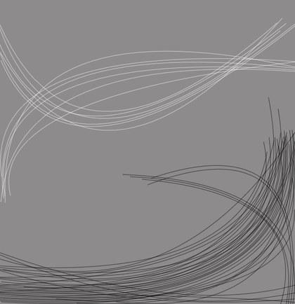
      </a>
       
      SVG 8.6 KB
    </td>
    <td align="center">
      
       
      SVG 33.5 KB
    </td>
    <td align="center">
      
       
      SVG 167.1 KB
    </td>
  </tr>
  <tr>
    <td><strong>Rotated Ellipse</strong></td>
    <td align="center">
      <a href="images/progression/kenna-fiume-po/rotated-ellipse-50.svg">
        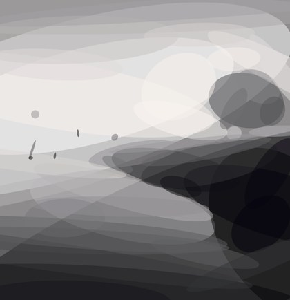
      </a>
       
      SVG 9.2 KB
    </td>
    <td align="center">
      
       
      SVG 36.3 KB
    </td>
    <td align="center">
      
       
      SVG 180.5 KB
    </td>
  </tr>
  <tr>
    <td><strong>Polygon</strong></td>
    <td align="center">
      <a href="images/progression/kenna-fiume-po/polygon-50.svg">
        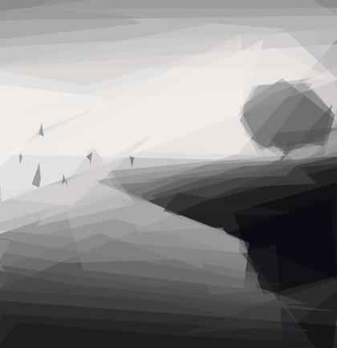
      </a>
       
      SVG 7.8 KB
    </td>
    <td align="center">
      
       
      SVG 30.6 KB
    </td>
    <td align="center">
      
       
      SVG 152.1 KB
    </td>
  </tr>
</table>

### Spongebob

   
  Original · JPG 51.3 KB

<table>
  <tr>
    <th align="left">Shape mode</th>
    <th align="center">50 steps</th>
    <th align="center">200 steps</th>
    <th align="center">1000 steps</th>
  </tr>
  <tr>
    <td><strong>Mixed</strong></td>
    <td align="center">
      <a href="images/progression/spongebob/any-50.svg">
        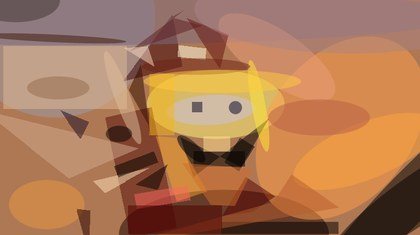
      </a>
       
      SVG 6.4 KB
    </td>
    <td align="center">
      
       
      SVG 25.4 KB
    </td>
    <td align="center">
      
       
      SVG 130.2 KB
    </td>
  </tr>
  <tr>
    <td><strong>Triangle</strong></td>
    <td align="center">
      
       
      SVG 4.6 KB
    </td>
    <td align="center">
      
       
      SVG 17.9 KB
    </td>
    <td align="center">
      <a href="images/progression/spongebob/triangle-1000.svg">
        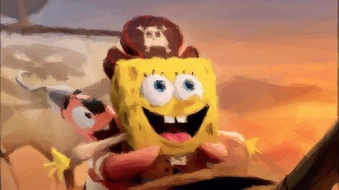
      </a>
       
      SVG 88.6 KB
    </td>
  </tr>
  <tr>
    <td><strong>Rectangle</strong></td>
    <td align="center">
      
       
      SVG 4.8 KB
    </td>
    <td align="center">
      
       
      SVG 18.7 KB
    </td>
    <td align="center">
      
       
      SVG 92.4 KB
    </td>
  </tr>
  <tr>
    <td><strong>Ellipse</strong></td>
    <td align="center">
      
       
      SVG 4.7 KB
    </td>
    <td align="center">
      <a href="images/progression/spongebob/ellipse-200.svg">
        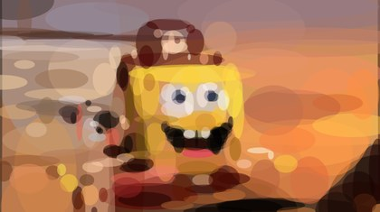
      </a>
       
      SVG 18.3 KB
    </td>
    <td align="center">
      
       
      SVG 90.2 KB
    </td>
  </tr>
  <tr>
    <td><strong>Circle</strong></td>
    <td align="center">
      
       
      SVG 4.7 KB
    </td>
    <td align="center">
      
       
      SVG 18.3 KB
    </td>
    <td align="center">
      
       
      SVG 90.1 KB
    </td>
  </tr>
  <tr>
    <td><strong>Rotated Rectangle</strong></td>
    <td align="center">
      <a href="images/progression/spongebob/rotated-rectangle-50.svg">
        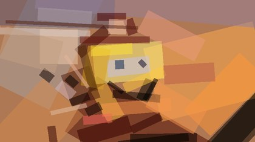
      </a>
       
      SVG 7.9 KB
    </td>
    <td align="center">
      <a href="images/progression/spongebob/rotated-rectangle-200.svg">
        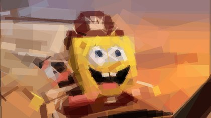
      </a>
       
      SVG 31.0 KB
    </td>
    <td align="center">
      
       
      SVG 153.8 KB
    </td>
  </tr>
  <tr>
    <td><strong>Quadratic</strong></td>
    <td align="center">
      
       
      SVG 8.5 KB
    </td>
    <td align="center">
      
       
      SVG 33.4 KB
    </td>
    <td align="center">
      <a href="images/progression/spongebob/quadratic-1000.svg">
        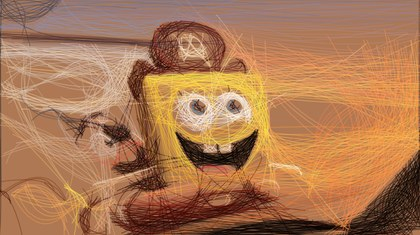
      </a>
       
      SVG 166.0 KB
    </td>
  </tr>
  <tr>
    <td><strong>Rotated Ellipse</strong></td>
    <td align="center">
      <a href="images/progression/spongebob/rotated-ellipse-50.svg">
        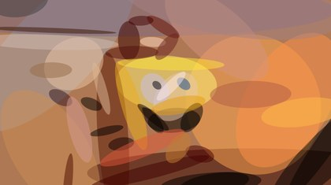
      </a>
       
      SVG 9.2 KB
    </td>
    <td align="center">
      
       
      SVG 36.2 KB
    </td>
    <td align="center">
      
       
      SVG 179.8 KB
    </td>
  </tr>
  <tr>
    <td><strong>Polygon</strong></td>
    <td align="center">
      
       
      SVG 7.7 KB
    </td>
    <td align="center">
      
       
      SVG 30.2 KB
    </td>
    <td align="center">
      
       
      SVG 150.0 KB
    </td>
  </tr>
</table>

<!-- markdownlint-enable MD033 -->
